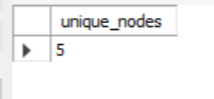
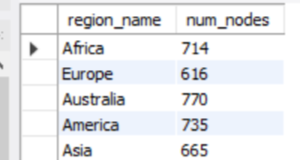
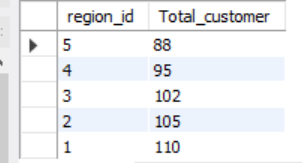
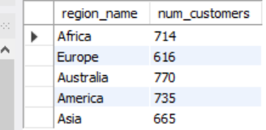
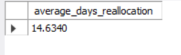
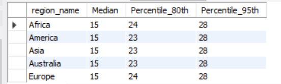

# [A] Customer Nodes Exploration

## -

### --

#### [1] How many unique nodes are there on the Data Bank system?

```sql
select count(distinct node_id) as unique_nodes
from data_bank.customer_nodes;

```



#### [2] What is the number of nodes per region?

```sql
SELECT r.region_name, COUNT(cn.node_id) AS num_nodes
FROM regions r
INNER JOIN customer_nodes cn ON r.region_id = cn.region_id
GROUP BY r.region_name;
```



#### [3] How many customers are allocated to each region?

```sql
select region_id, count(distinct customer_id) as Total_customer 
from customer_nodes
group by region_id
order by count(distinct customer_id);
```



##### OR

```sql
SELECT r.region_name, COUNT(cn.customer_id) AS num_customers
FROM regions r
INNER JOIN customer_nodes cn ON r.region_id = cn.region_id
GROUP BY r.region_name;
```



#### [4] How many days on average are customers reallocated to a different node?

```sql
SELECT
AVG(DATEDIFF(end_date, start_date)) AS average_days_reallocation
FROM
customer_nodes
WHERE
end_date IS NOT NULL AND YEAR(end_date) <> 9999;
```



#### [5] What is the median, 80th and 95th percentile for this same reallocation days metric for each region?

```sql
with rows_ as (
select c.customer_id,
r.region_name, DATEDIFF(c.end_date, c.start_date) AS days_difference,
row_number() over (partition by r.region_name order by DATEDIFF(c.end_date, c.start_date)) AS rows_number,
COUNT(*) over (partition by r.region_name) as total_rows  
from
customer_nodes c JOIN regions r ON c.region_id = r.region_id
where c.end_date not like '%9999%'
)
SELECT region_name,
ROUND(AVG(CASE WHEN rows_number between (total_rows/2) and ((total_rows/2)+1) THEN days_difference END), 0) AS Median,
MAX(CASE WHEN rows_number = round((0.80 * total_rows),0) THEN days_difference END) AS Percentile_80th,
MAX(CASE WHEN rows_number = round((0.95 * total_rows),0) THEN days_difference END) AS Percentile_95th
from rows_
group by region_name;
```


