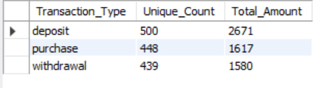

# [B] Customer Transactions

## -

### --

#### [1] What is the unique count and total amount for each transaction type?

```sql
select txn_type as Transaction_Type, count(distinct(customer_id)) as Unique_Count, count(txn_type) as Total_Amount
from customer_transactions
group by Transaction_Type

```



#### [2] What is the average total historical deposit counts and amounts for all customers?

```sql
SELECT 
    AVG(deposit_count) AS average_deposit_count,
    AVG(total_deposit_amount) AS average_deposit_amount
FROM (
    SELECT 
        customer_id,
        COUNT(txn_type) AS deposit_count,
        SUM(CASE WHEN txn_type = 'deposit' THEN txn_amount ELSE 0 END) AS total_deposit_amount
    FROM 
        customer_transactions
    GROUP BY 
        customer_id
) AS deposit_summary;

```


#### [3] For each month - how many Data Bank customers make more than 1 deposit and either 1 purchase or 1 withdrawal in a single month?

```sql
SELECT
    YEAR(txn_date) AS year,
    MONTH(txn_date) AS month,
    customer_id,
    COUNT(CASE WHEN txn_type = 'deposit' THEN 1 END) AS deposit_count,
    COUNT(CASE WHEN txn_type = 'purchase' THEN 1 END) AS purchase_count,
    COUNT(CASE WHEN txn_type = 'withdrawal' THEN 1 END) AS withdrawal_count
FROM
    customer_transactions
GROUP BY
    YEAR(txn_date),
    MONTH(txn_date),
    customer_id
HAVING
    deposit_count > 1 AND (purchase_count = 1 OR withdrawal_count = 1); 

```


#### [4] What is the closing balance for each customer at the end of the month?

```sql
SELECT
  customer_id,
  EXTRACT(YEAR FROM txn_date) AS year,
  EXTRACT(MONTH FROM txn_date) AS month,
  SUM(CASE WHEN txn_type = 'deposit' THEN txn_amount ELSE 0 END) - 
  SUM(CASE WHEN txn_type IN ('purchase', 'withdrawal') THEN txn_amount ELSE 0 END) AS closing_balance
FROM
  customer_transactions
GROUP BY
  customer_id,
  EXTRACT(YEAR FROM txn_date),
  EXTRACT(MONTH FROM txn_date)
ORDER BY
  customer_id,
  year,
  month;

```


#### [5] What is the percentage of customers who increase their closing balance by more than 5%?

```sql
WITH CustomerBalances AS (
    SELECT
        customer_id,
        SUM(CASE WHEN txn_type = 'deposit' THEN txn_amount ELSE 0 END) AS TotalDeposits,
        SUM(CASE WHEN txn_type = 'purchase' THEN txn_amount ELSE 0 END) AS TotalPurchases
    FROM
        customer_transactions
    GROUP BY
        customer_id
),
BalanceChanges AS (
    SELECT
        customer_id,
        TotalDeposits,
        TotalPurchases,
        (TotalDeposits - TotalPurchases) AS NetBalanceChange,
        ((TotalDeposits - TotalPurchases) / NULLIF(TotalDeposits, 0)) * 100 AS PercentageIncrease
    FROM
        CustomerBalances
)

SELECT
    COUNT(*) AS TotalCustomers,
    SUM(CASE WHEN PercentageIncrease > 5 THEN 1 ELSE 0 END) AS CustomersIncreasedMoreThan5Percent,
    (SUM(CASE WHEN PercentageIncrease > 5 THEN 1 ELSE 0 END) * 1.0 / COUNT(*)) * 100 AS PercentageOfCustomersIncreasedMoreThan5Percent
FROM
    BalanceChanges;

```

