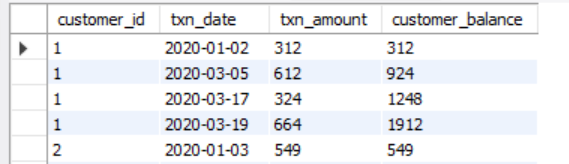
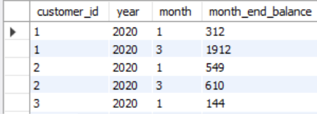
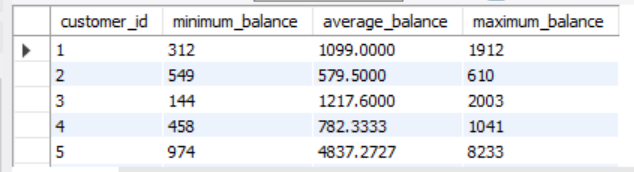

# [C] Data Allocation Challenge 

## -

### --

#### running customer balance column that includes the impact each transaction

```sql

SELECT 
    customer_id, 
    txn_date,  
    txn_amount, 
    SUM(txn_amount) OVER (PARTITION BY customer_id ORDER BY txn_date) AS customer_balance
FROM 
    customer_transactions;

```



#### customer balance at the end of each month

```sql
SELECT 
    customer_id, 
    YEAR(txn_date) AS year, 
    MONTH(txn_date) AS month, 
    MAX(running_balance) AS month_end_balance 
FROM 
    (
        SELECT 
            customer_id, 
            txn_date,
            SUM(txn_amount) OVER (PARTITION BY customer_id ORDER BY txn_date) AS running_balance
        FROM 
            customer_transactions
    ) AS monthly_balance
GROUP BY 
    customer_id, year, month
ORDER BY 
    customer_id, year, month;
```



#### minimum,average and maximum values of the running balance for each customer

```sql
WITH customer_balance AS (
    SELECT 
        customer_id, 
        txn_date, 
        SUM(txn_amount) OVER (PARTITION BY customer_id ORDER BY txn_date) AS running_balance
    FROM 
        customer_transactions
)
SELECT 
    customer_id, 
    MIN(running_balance) AS minimum_balance,
    AVG(running_balance) AS average_balance,
    MAX(running_balance) AS maximum_balance
FROM 
    customer_balance
GROUP BY 
    customer_id;
```


