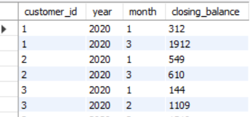
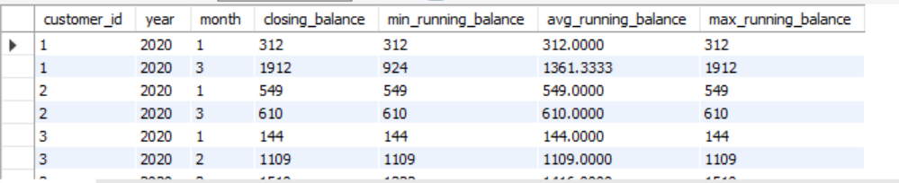
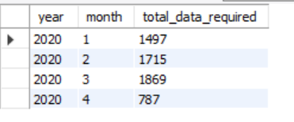
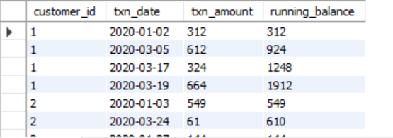
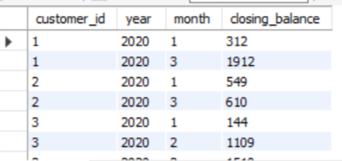
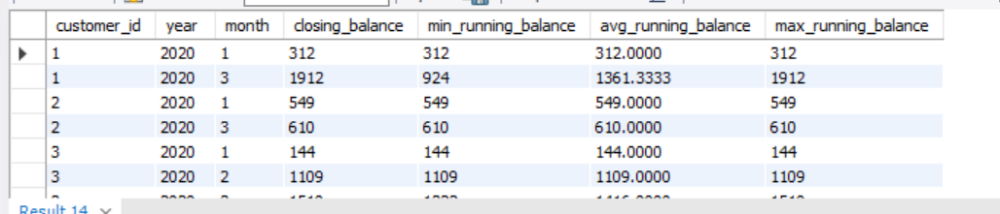

# [C] Data Allocation Challenge 

## Option 1: data is allocated based off the amount of money at the end of the previous month

### 1 - running customer balance column that includes the impact each transaction

```sql

-- Step 1: Calculate the running customer balance up to the end of the previous month
WITH RunningBalance AS (
    SELECT 
        customer_id,
        txn_date,
        txn_amount,
        SUM(txn_amount) OVER (PARTITION BY customer_id ORDER BY txn_date) AS running_balance
    FROM 
        customer_transactions
    WHERE 
        txn_date < DATE_FORMAT(CURRENT_DATE, '%Y-%m-01') -- Consider transactions up to the end of the previous month
)
SELECT 
    *
FROM 
    RunningBalance;

```


### 2 - customer balance at the end of each month
```sql
-- Step 2: Calculate the customer balance at the end of each month
WITH RunningBalance AS (
    SELECT 
        customer_id,
        txn_date,
        txn_amount,
        SUM(txn_amount) OVER (PARTITION BY customer_id ORDER BY txn_date) AS running_balance
    FROM 
        customer_transactions
    WHERE 
        txn_date < DATE_FORMAT(CURRENT_DATE, '%Y-%m-01') -- Consider transactions up to the end of the previous month
),
CustomerBalance AS (
    SELECT 
        customer_id,
        YEAR(txn_date) AS year,
        MONTH(txn_date) AS month,
        MAX(running_balance) AS closing_balance
    FROM 
        RunningBalance
    GROUP BY 
        customer_id,
        YEAR(txn_date),
        MONTH(txn_date)
)
SELECT 
    *
FROM 
    CustomerBalance;

```



### 3 - minimum, average and maximum values of the running balance for each customer

```sql
    -- Step 3: Calculate the minimum, average, and maximum values of the running balance for each customer
WITH RunningBalance AS (
    SELECT 
        customer_id,
        txn_date,
        txn_amount,
        SUM(txn_amount) OVER (PARTITION BY customer_id ORDER BY txn_date) AS running_balance
    FROM 
        customer_transactions
    WHERE 
        txn_date < DATE_FORMAT(CURRENT_DATE, '%Y-%m-01') -- Consider transactions up to the end of the previous month
),
CustomerBalance AS (
    SELECT 
        customer_id,
        YEAR(txn_date) AS year,
        MONTH(txn_date) AS month,
        MAX(running_balance) AS closing_balance,
        MIN(running_balance) AS min_running_balance,
        AVG(running_balance) AS avg_running_balance,
        MAX(running_balance) AS max_running_balance
    FROM 
        RunningBalance
    GROUP BY 
        customer_id,
        YEAR(txn_date),
        MONTH(txn_date)
)
SELECT 
    *
FROM 
    CustomerBalance;

```




### Calculating the total data required on a monthly basis

```sql
SELECT 
    YEAR(txn_date) AS year,
    MONTH(txn_date) AS month,
    COUNT(*) AS total_data_required
FROM 
    customer_transactions
GROUP BY 
    YEAR(txn_date),
    MONTH(txn_date)
ORDER BY 
    year, 
    month;
```



## Option 2: data is allocated on the average amount of money kept in the account in the previous 30 days

```sql

-- Create a temporary table to store distinct transaction dates
CREATE TEMPORARY TABLE IF NOT EXISTS DateRanges AS (
    SELECT DISTINCT txn_date
    FROM customer_transactions
);

-- Cross join txn_running_balances with DateRanges and calculate the average running balance over the last 30 days
CREATE TEMPORARY TABLE IF NOT EXISTS Averages AS (
    SELECT
        a.customer_id,
         d.txn_date,
        AVG(a.running_balance) AS avg_30day_running_balance
    FROM
        txn_running_balances a
    CROSS JOIN
        DateRanges d
    WHERE
        d.txn_date <= d.txn_date
        AND d.txn_date > DATE_SUB(d.txn_date, INTERVAL 30 DAY)
    GROUP BY
        a.customer_id,
        d.txn_date
);

-- Select data from Averages
SELECT *
FROM Averages
ORDER BY
    customer_id,
    txn_date;
```




### 1 running customer balance column that includes the impact each transaction

```sql
--------------Step 1
-- Calculate the running customer balance column
SELECT
    customer_id,
    txn_date,
    SUM(txn_amount) OVER (PARTITION BY customer_id ORDER BY txn_date) AS running_customer_balance
FROM
    customer_transactions
ORDER BY
    customer_id,
    txn_date;
```


### 2 customer balance at the end of each month

```sql
--------------Step 2
    -- Calculate the customer balance at the end of each month
SELECT
    customer_id,
    LAST_DAY(txn_date) AS end_of_month,
    SUM(txn_amount) AS customer_balance
FROM
    customer_transactions
GROUP BY
    customer_id,
    end_of_month
ORDER BY
    customer_id,
    end_of_month;
```



### 3 minimum, average and maximum values of the running balance for each customer

```sql
--------------Step 3
-- Calculate minimum, average, and maximum values of the running balance for each customer
SELECT
    customer_id,
    MIN(running_customer_balance) AS min_balance,
    AVG(running_customer_balance) AS avg_balance,
    MAX(running_customer_balance) AS max_balance
FROM
    (
        SELECT
            customer_id,
            txn_date,
            SUM(txn_amount) OVER (PARTITION BY customer_id ORDER BY txn_date) AS running_customer_balance
        FROM
            customer_transactions
    ) AS running_balances
GROUP BY
    customer_id;
#*/
```

