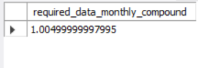

# [D] Extra Challenge

## Data Bank wants to try another option which is a bit more difficult to implement

### If the annual interest rate is set at 6% and the Data Bank team wants to reward its customers by increasing their data allocation based off the interest calculated on a daily basis at the end of each day, how much data would be required for this option on a monthly basis?


```sql
SET @P = 1; -- Principal amount
SET @r = 0.06; -- Annual interest rate as a decimal
SET @n = 365; -- Number of compounding periods per year (daily)
SET @t = 1/12; -- Time in years for one month

-- Compounding interest calculation (approximation for daily compounding over one month)
SELECT @P * POW((1 + @r / @n), (@n * @t)) AS required_data_compound;
SET @P = 1; -- Principal amount (e.g., 1 GB of data)
SET @r = 0.06; -- Annual interest rate as a decimal
SET @n = 12; -- Number of compounding periods per year (monthly)
SET @t = 1/12; -- Time in years for one month

-- Monthly compounding interest calculation
SELECT @P * POW((1 + @r / @n), (@n * @t)) AS required_data_monthly_compound;

```
