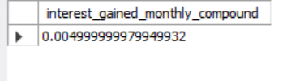

# [D] Extra Challenge

## Data Bank wants to try another option which is a bit more difficult to implement

### If the annual interest rate is set at 6% and the Data Bank team wants to reward its customers by increasing their data allocation based off the interest calculated on a daily basis at the end of each day, how much data would be required for this option on a monthly basis?

```sql
SET @P = 1; 
SET @r = 0.06; 
SET @n = 365; 
SET @t = 1/12; 

SELECT @P * POW((1 + @r / @n), (@n * @t)) - @P AS interest_gained_daily_compound;

SET @P = 1;
SET @r = 0.06; SET @n = 12; 
SET @t = 1/12; 

SELECT @P * POW((1 + @r / @n), (@n * @t)) - @P AS interest_gained_monthly_compound;
```

